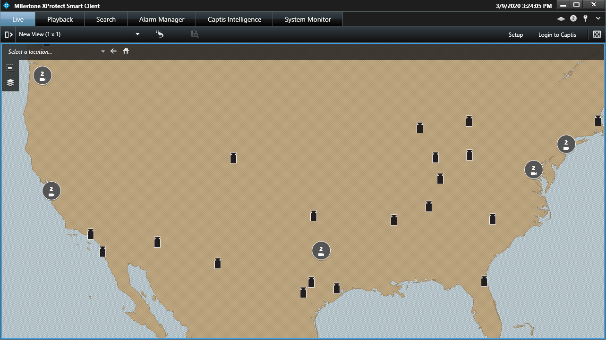

<br />
<p align="center">
  <a href="https://github.com/MilestoneSystemsInc/PowerShellSamples">
    
  </a>

  <h3 align="center">Import-GpsCoordinates</h3>

  <p align="center">
    Update the GPS coordinates of cameras in Milestone based on a CSV file
  </p>
</p>


## Get-Help Import-GpsCoordinates -Full

```powershell
NAME
    Import-GpsCoordinates
    
SYNOPSIS
    Updates the GPS coordinates of cameras in Milestone based on a CSV file with MAC addresses
    and the corresponding GPS coordinates.
    
    
SYNTAX
    Import-GpsCoordinates [-Path] <String> [[-MacColumn] <String>] [[-CoordinateColumn] <String>] [<CommonParameters>]
    
    
DESCRIPTION
    This sample function allows you to override the default column names of "MAC" and 
    "Coordinates" if desired, and the coordinates are expected to be found in
    "latitude, longitude" format with no special characters except the separating comma.
    

PARAMETERS
    -Path <String>
        The path to the source CSV file to use as input.
        
        Required?                    true
        Position?                    1
        Default value                
        Accept pipeline input?       true (ByValue, ByPropertyName)
        Accept wildcard characters?  false
        
    -MacColumn <String>
        Override the default column name to look for in the CSV file for the hardware MAC address.
        Default: MAC
        
        Required?                    false
        Position?                    2
        Default value                MAC
        Accept pipeline input?       false
        Accept wildcard characters?  false
        
    -CoordinateColumn <String>
        Override the default column name to look for in the CSV file for the camera coordinates address.
        Default: Coordinates
        
        Required?                    false
        Position?                    3
        Default value                Coordinates
        Accept pipeline input?       false
        Accept wildcard characters?  false
        
    <CommonParameters>
        This cmdlet supports the common parameters: Verbose, Debug,
        ErrorAction, ErrorVariable, WarningAction, WarningVariable,
        OutBuffer, PipelineVariable, and OutVariable. For more information, see 
        about_CommonParameters (https:/go.microsoft.com/fwlink/?LinkID=113216). 
    
INPUTS
    
OUTPUTS
    
    -------------------------- EXAMPLE 1 --------------------------
    
    PS C:\>Import-GpsCoordinates -Path .\coordinates.csv
    
    Uses coordinates.csv to update the GisPoint property of all cameras who's parent Hardware object
    has a MAC address value found in the CSV file.
    
    
    
    
    
RELATED LINKS
```