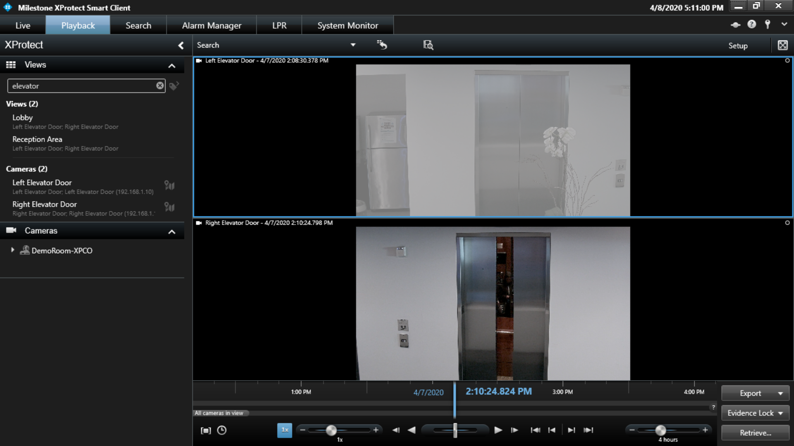

## Exportación de video programada

<a href="https://youtu.be/qGCep6XjXmc">
    
</a>

En este ejemplo usaremos el cmdlet Register-ScheduledJob incluido en PowerShell para crear una tarea programada en Windows que ejecute nuestro script de exportación todos los días a medianoche.

El siguiente ejemplo se puede copiar y pegar en una instancia elevada de PowerShell o PowerShell ISE. Asegúrese de ejecutar PowerShell como administrador; de lo contrario, Register-ScheduledJob producirá un error.

La secuencia de comandos recopilará la dirección y las credenciales de VMS, y le pedirá una palabra clave de selección de cámara. Si desea exportar todas las cámaras con la palabra "Ascensor" en el nombre, puede ingresarla como palabra clave. La palabra clave no distingue entre mayúsculas y minúsculas. A continuación, se le pedirá una ruta de destino para guardar las exportaciones. Cada exportación se almacenará aquí en una subcarpeta con la fecha marcada. Antes de registrar el trabajo programado, se validarán las credenciales y la selección de la cámara. Si no se puede realizar una conexión o no hay cámaras que coincidan con la palabra clave proporcionada, no se creará el trabajo programado.

El bit $expandingString puede parecer algo extraño. Lo que estamos haciendo aquí es crear un bloque de secuencia de comandos donde las variables específicas se expanden en sus valores reales antes de almacenarse en el trabajo programado. Esto nos permite pasar las respuestas desde la parte superior de la secuencia de comandos al cuerpo del scriptblock llamado por el trabajo programado.

Al hacerlo de esta manera, podemos pedirle sus credenciales de VMS sin exponer su contraseña o tener que conservarla en el disco en forma cifrada. Su contraseña se recopila como una cadena segura y, a continuación, se convierte en una cadena larga que solo puede descifrar el usuario de Windows con el que está ejecutando la secuencia de comandos.


```powershell
$InformationPreference = 'Continue'
$server = Read-Host -Prompt "Server Address"
$username = Read-Host -Prompt "Username"
$password = Read-Host -Prompt "Password" -AsSecureString | ConvertFrom-SecureString

do {
    $isBasic = Read-Host -Prompt "Basic user? (y/n)"
} while ('y', 'n' -notcontains $isBasic)

$keyword = Read-Host -Prompt "Keyword for camera selection"

do {
    $destination = Read-Host -Prompt "Export path"
} while (-not (Test-Path -Path $destination))

try {
    Write-Information "Validating credentials and camera selection before we register the scheduled job"
    Write-Information "Connecting to $server as $username"
    $connected = $false
    Connect-ManagementServer -Server $server -Credential ([pscredential]::new($username, ($password | ConvertTo-SecureString))) -BasicUser:($isBasic -eq 'y')
    Write-Information "Connected"
    $connected = $true

    Write-Information "Verifying there is at least one camera with a name matching keyword '$keyword'"
    $cameras = Get-Hardware | Where-Object Enabled | Get-Camera | Where-Object { $_.Enabled -and $_.Name -like "*$keyword*" }
    if ($null -eq $cameras) {
        throw "No cameras found matching keyword '$keyword'"
    }
    else {
        Write-Information "Identified $($cameras.Count) cameras matching keyword '$keyword'"
    }
}
catch {
    throw
}
finally {
    if ($connected) {
        Disconnect-ManagementServer
    }
}


$expandingString = "
    `$pass = '$password' | ConvertTo-SecureString
    `$cred = [pscredential]::new('$username', `$pass)
    `$isBasic = '$isBasic' -eq 'y'
    Connect-ManagementServer -Server $server -Credential `$cred -BasicUser:`$isBasic
    `$cameras = Get-Hardware | Where-Object Enabled | Get-Camera | Where-Object { `$_.Enabled -and `$_.Name -like '*$keyword*' }

    `$start = (Get-Date -Hour 13 -Minute 0 -Second 0).AddDays(-1)
    `$end = (Get-Date -Hour 15 -Minute 0 -Second 0).AddDays(-1)

    Start-Export -CameraIds `$cameras.Id -StartTime `$start -EndTime `$end -Format DB -Path ""$destination\`$(`$start.ToString('yyyy-MM-dd'))""

    Disconnect-ManagementServer
"

$script = [scriptblock]::Create($expandingString)
$trigger = New-JobTrigger -Daily -DaysInterval 1 -At (Get-Date -Hour 0 -Minute 0)
Register-ScheduledJob -Name "Automated Export Example" -ScriptBlock $script -Trigger $trigger
```
