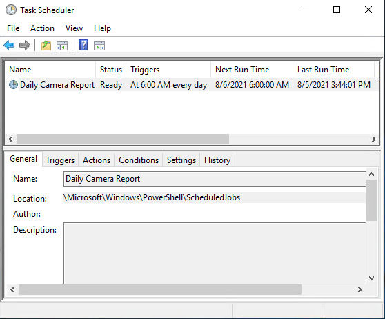

# Informe de cámara programado

Hay muchas maneras de ejecutar secuencias de comandos/tareas programadas. En Windows, la forma más común es a través del Programador de tareas de Windows. Incluso existen varias formas de ejecutar secuencias de comandos de PowerShell en el Programador de tareas. Usted puede crear una tarea programada estándar a mano, o mediante algunos de los cmdlets de PowerShell en el módulo ScheduledTasks o, por último, mediante el módulo PSScheduledJob, que es la ruta que tomé para este ejemplo.
Para utilizar este ejemplo, puede descargar ScheduledCameraReport.ps1 y colocarlo en una carpeta en el cliente o servidor de Windows donde desea que se encuentren los archivos de registro y los CSV de informes de cámara. Por ejemplo, puede colocarlo en `C:\scripts\ScheduledCameraReports\`. A continuación, abra PowerShell como administrador y ejecute la secuencia de comandos. ¡Eso es todo!

## Pero, ¿cómo funciona?

La secuencia de comandos utiliza el nuevo parámetro de cambio “ShowDialog” en Connect-ManagementServer para darle la oportunidad de conectarse con éxito a su servidor de gestión. Una vez conectado, sus opciones de inicio de sesión se conservan en el disco en un archivo connection.xml en la misma carpeta. Si proporcionó una contraseña, se cifrará como una cadena segura automáticamente utilizando el ámbito “CurrentUser”. Esto significa que solo su cuenta de usuario puede descifrar esa contraseña.

La tarea programada importará ese archivo connection.xml y colocará esos parámetros en el comando `Connect-ManagementServer`. Después de eso, ejecutamos el informe de la cámara y guardamos la salida en un archivo con marca de tiempo en la subcarpeta de informes que ahora debería existir en la carpeta en la que se encuentra su secuencia de comandos.

Se creará un archivo de registro gracias al uso de `Start-Transcript` para darle una idea de cómo se ejecutó la tarea durante la última ejecución. El archivo se sobrescribirá cada vez para evitar que *eventualmente* llene su disco con registros. Asimismo, cualquier informe de la cámara con más de 30 días de duración se eliminará durante cada ejecución.

## Reflexiones adicionales

El módulo PSScheduledJob es interesante por la forma en que funciona. Encontrará que la tarea programada ejecuta powershell.exe con un comando que carga la definición de trabajo programada desde `C:\Users\<user>\AppData\Local\Microsoft\Windows\PowerShell\ScheduledJobs`. Si sucede algo extraño y su archivo de registro de transcripción no lo muestra, puede encontrar más información en la subcarpeta `Salida` en la carpeta de definición de trabajo programada. Si la contraseña de usuario de Windows cambia, es posible que deba iniciar sesión en este equipo para asegurarse de que la secuencia de comandos todavía se está ejecutando, ya que se ejecuta bajo su contexto de usuario.

Si el servidor de gestión está en un sistema diferente al de esta secuencia de comandos, es posible que deba agregar el parámetro `Credencial` a `Register-ScheduledJob` y proporcionar la credencial de usuario de Windows, a menos que decida usar la autenticación explícita de usuario de Windows o la autenticación de usuario básico y proporcione un nombre de usuario y una contraseña mientras ejecuta la secuencia de comandos para crear el trabajo o la tarea programados.
